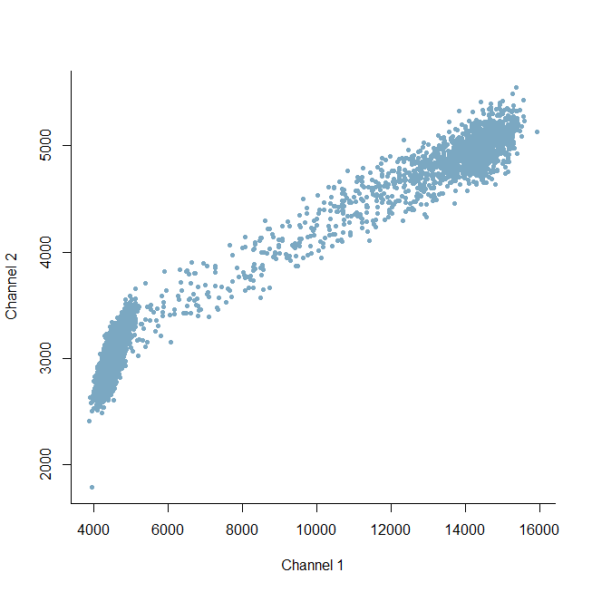
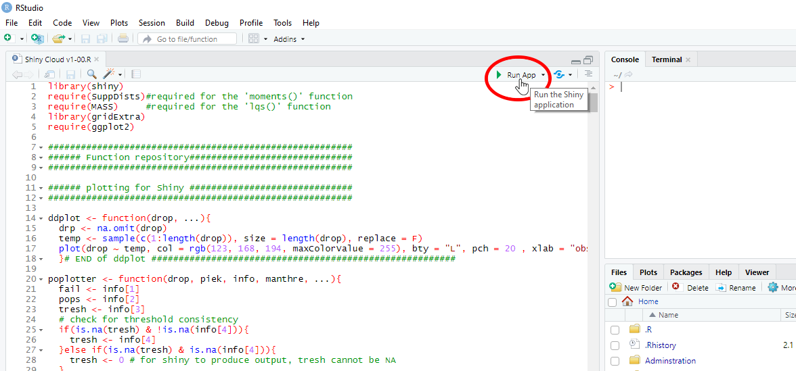

# Digital Droplet PCR analysis
This branch contains two R scripts related to digital PCR analysis. Both scripts were written to handle output from the Biorad QX200 platform, but the main analysis algortighm (cloudy.R) should be able to handle any type of digital PCR output provided the data have the correct format (more on that later).

The two scripts are:
- Cloudy-Vx-xx.R
- read_QX.R

Algorithm cloudy_V2-04 & read_QX  were originally provided as supplemental material to the publication "*Measuring digital PCR quality: Performance Parameters and their Optimization*" by Antoon Lievens, Sara Jacchia, Dafni Kagkli, Cristian Savini, and Maddalena Querci ([link](http://dx.doi.org/10.1371/journal.pone.0153317)). The cloudy algorithm has since evolved to V2-08 & V03-03 (more on that below), but V2-04 remains available. In addition, this branch also contains the full dataset on which the publication was based (`Dataset.zip`) which may be used to further explore the functions of the scripts provided.  

In addition, a few related functions have been added: a function to quickly plot digital PCR data and a shiny app based on the clpudy algorithm providing a graphical interface for users that are less comfortable with R's command line interface.

Additional functions:
- MonoColor ddplot.R
- Shiny Cloud Vx-xx.R

The following paragraphs contain a brief overview of the functionality of these algorithms and fucntions. In most cases, details on their use is also contained as commented text in the .R files themselves. The very last paragraph contains information on the structure of the dataset provided (i.e. `Dataset.zip`).

## The 'read.QX' & 'read.Naica' algorithm
These functions read the raw fluorescence values, as exported from the Biorad or Stilla software, into R. F

The function output is a list containing two matrices (one for each channel). Each column in the matrix is a reaction and each row contains fluorscence readings. As the number of readings per reaction may differ, reactions with less accepted droplets are padded with `NA` to fill the matrices. The order of the reactions in the matrix is the order in which they were read from the folder (usually alphabetical) it is therefore recommended to set `autoname = TRUE` in order to be able to identify each column correctly. The cluster data is currently not imported into R as the cloudy algortihm has no use for it. Note that the algorithm will attempt to read **any** .csv file present in a folder, so make sure that only .csv files containing raw ddPCR data are present.

The basic function call to read.QX takes the following arguments:
```
read.QX(directory, nr.r = NA, autoname = TRUE)
read.Naica(directory, nr.r = NA, autoname = TRUE)
```
- `directory` is a character vector of length 1 indicating the location of the CSV files (either path or name of the folder in the working directory)
- `nr.r` is an optional numerical of length 1 indicating the number of rows to be used in the matrix (missing values will be padded with NA). If `nr.r = NA`, the largest number of droplets in the analysis will be used. This option is usefull if you want to read several folders of data and then merge the resulting matrices, for instance, using `cbind`.
- `autoname` is a logical, if `TRUE` the well names are collected from the .csv files and used as column names. Essentially, the script looks for whatever is contained between two underscores ("_") and uses this as the column name (The biorad software adds a suffix to the plate name containing the well name).  Therefore, it is strongly recommended **never** to use underscores in the plate name, this may crash the algortihm. If you did and still want to use the algorithm, you can either change to code to fit your plate names, or look into a batch-rename program (e.g. [rename master](http://rename-master.en.softonic.com/)). For similar reasons the algorithm currently only works if there are 96 or less csv files  (to prevent duplicate column names). If there are more, a warning message will be reported. 

### Example
Unzip the folder contained in `example.zip` into you working directory and have all .R and files from this branch placed there as well before running the example. 

```
source("read_QX.R")

# read files from folder
d.data <- read.QX(directory = "example QXfiles")

# plot a single reaction
plot(sample(d.data$Ch1[, 1]), ylab = "Amplitude", bty = "L")
```

## The 'cloudy' algorithm

This is the algorithm for digital PCR analysis from raw compartment fluorescence measurements, several versions are available.

### V2.04
This is the original algorithm provided as supplemental material to the publication "Measuring digital PCR quality: Performance Parameters and their Optimization" by Antoon Lievens, Sara Jacchia, Dafni Kagkli and Cristian Savini, and Maddalena Querci ([link](http://dx.doi.org/10.1371/journal.pone.0153317)). For details on the interpretation of results and background on the algorithm we refer the user to the original text of the publication.

### V2.05 & 2.08
These two versions are optimizations of the original algorithm, with version 2.08 being the final version of the V2 series of the algorithm. The main improvements are: general improvements for stability, removal of typos, increased robustness when dealing with overlapping populations, a manual threshold option, the threshold as calculated was added to output, and one of the plots was removed (performance parameter plot, it was not getting the point accross anyway).

### V3 & beyond
This series has a thoroughly re-structured code that will allow further implementation of additional functionalities. The main change for the user is probably the way the data are presented to the algorithm. Whereas in previous versions a single channel of a sigle reaction had to used as input, these version will take the entire read.QX output object as input. A seperate input variable 'well' allows for selection of which well(s) to analyse. Choice of the channel is done via the 'method' input variable.

Chief among the new functionalities is the ability to 'correct' for channel cross talk. The latter is a phenomenon caused by overlapping or overshining of color spectra of the dye(s) and as a result the measurements made in the 2 fluorescence channels are not entirely independent. This is most obvious from the 2D plot (channel 1 FU on x axis and channel 2 FU on y axis): in an ideal case increase in channel 1 fluorescence should not affect the y position of the droplets, instead we see that the channel 2 fluorescence also increases (droplets move diagonal on the plot instead of horizontal). The figure below illustrates this for an evagreen reaction: instead of the droplets all lying in the horizontal plane (all fluorescence limited to channel 1) we see a diagonal display as also channel 2 fluorescence increases when channel 1 FU reaches higher values. Ultimately, this affects the resolution of the assay.



The current version is able to correct for this to some degree (currenlty only intended for Evagreen reactions, but feel free to play around), which helps place the threshold in low resolution reactions. It has been tested on a wide array of reactions (more than 5000) and seems stable. Note: since the cross-talk correction relies on a few iterations of algorithm application it runs slower. 

Other analysis modes include: simplex (analysis of channel 1), simplex2 (analysis of channel 2), duplex (analysis of both channels), and the aforementioned 'eva' mode that corrects for channel cross talk.

Another new feature of the V3 series is the option to choose different threshold setting approaches. I have implemented the Generalized Extreme Value (GEV) approach of Trypsteen et al. ([go read their publication](https://link.springer.com/article/10.1007/s00216-015-8773-4)) on a single reaction basis. It should be noted that the method is intended to be used on NTC reactions to calculate a threshold that is than applied accross other (baseline corrected) other reactions, because the 'extreme values' should be sampled from the true negative distribution in order to calculate the threshold. I've worked around this by using the 'rough guess where the populations are' (that is the first step in the cloudy algorithm) to select which droplets to feed into the GEV routine. This works well, but is sensitive to rain and of course cannot be used if there are not enough negative droplets. Where 'cloudy' is fairly conservative in its threshold placement, 'gev' tends to set threshold very close to the negative cloud. To use it, specify `threshold = "gev"`.

Another threshold option available is 'mixed' here, 'cloudy' and 'gev' are run sequential, giving 'gev' the benefit of a better negative population selection as performed by 'cloudy'. Both thresholds are calculated and averaged, providing a third option in threshold calculation. As 'gev' tends to fail in reactions that are close to saturation, 'cloudy' is always used as back-up mechanism, ensuring valid output. 

### algorithm output and input

The standard function output is a list with the following components:
- `targets.in.sVol`, a numerical vector of length three containing the estimated number of targets in the sample volume (`targ.in.sVol`) and its Poisson confidence bounds (`upper`, `lower`).
- `lambda`, a numerical vector of length three containing the estimated average number of targets per compartment (`lambda`) and its Poisson confidence bounds (`upper`, `lower`).
- `performance`, a numerical vector of length three containing the performance paramters calculated from the input data: `resolution`, ratio of rain to total compartments (`%rain`), and the degree of compartmentalization (`%comparted`)
- `droplets`, a numerical vector of length three containing the number of compartments counted in each category (`positive`, `negative`, & `rain`).
- `populations`, a numerical of length 1, the number of fluorescence populations as detected by the algorithm 
- `threshold`, a numerical of length 1, the fluorescence value used as threshold 

Note that if `vec` is set to `TRUE`, all of the above parameters are returned in a single vector rather than as a list. If multiple reactions are analysed at the same time, the ouput will be a matrix with the columns corresponding to the results of the different reactions. 

If more than one channel is analysed (e.g. in `method = "duplex"`) a second row will be added to the output for the second channel. If multiple reactions are analysed in duplex, the output will be a list containing two matrices (`$Ch1` and `$Ch2`) with the results of the corresponding channels.
 
The basic function call to cloudy takes the following arguments:

V2 series :  `cloudy(drp, dVol = 0.85, sVol = 20, threshold = NA, plots = FALSE, silent = TRUE, vec = FALSE)`  
V3.07 and higer :  `cloudy(drp, well, method = , dVol = 0.85, sVol = 20, threshold = NA, plots = FALSE, silent = TRUE, vec = FALSE, neg.ref = 7500)`


- `drp` is a numeric vector of all (endpoint) fluorescence measurments in a digital reaction in V2.XX but should be a named list in V3.XX. In the latter case, the input should contain 2 objects ('Ch1' and 'Ch2') each of which should be a matrix containing the (endpoint) fluorescence measurments (one column per reaction) from the appropriate fluorescence channel. Note that the latter is the native output format of `read.QX()`. For both versions: the readings do **not** have to be ordered in any particular way although Quantasoft export is usually sorted from small to large. `NA` values are allowed (will be removed). Negative values are allowed as well (baseline subtraction may cause these in the Quantasoft export).
- `well` (for V3.04 and onwards) is a vector (either numerical or character) that selects which reactions are analyzed. Either by column number (eg `c(1,2,4,5)`) or
by column name (eg `c("A01", "C02", "H12")`) in the 'drp' input. defaults to 'all' (analyzes all reactions in the dataset). Note that if the numbers/names do not match existing columns there will be a warning and **all** reactions will be analyzed.
- `method` = (V3 only) string, type of analysis to be made. One of the following: "simplex", "simplex2", "duplex", or "eva" ('simplex' = analysis of the flourescence in channel 1, 'simplex2' = analysis of the flourescence in channel 2, "duplex" = simultanous analysis of channels 1 and 2, 'eva' = simplex analysis of channel 1 with channel crosstalk correction using channel 2 (designed for Evagreen)). (standard = "simplex)
- `threshold` either string or numerical of length 1. It selects which threshold calculation method used, one of the following: "cloudy", "gev", "mixed" or a number. Using a number will manually sets the threshold for counting positive and negative droplets (in Fluorescence Units) and overrides the algorithms calculations. "cloudy" is the default option, for background on "gev" and "mixed" see the above text. 
- `dVol` is a numerical of length 1, the compartment (droplet) volume in nanoliter (standard = 0.85)
- `sVol` is a  numerical of length 1, the sample volume in microliter (standard = 20) 
- `plots` is a logical, if set to `TRUE` plots will be generated (see below)
- `silent` is a logical, if is set to `FALSE` warning messages will be generated detailing the choices the algorithm makes when deviating from the standard analysis routine. 
- `vec` is a logical, if set to `TRUE` the results will be returned in a vector instead of a list. This is useful when you batch analyse dPCR reactions using `apply` and want the results to be returned as a matrix.
- `neg.ref` = (V3 only) is a numerical of length 1. This provides a reference where the algorithm expects the negative popultation to be. This will only be used when the algorithm can only find a single population: it wil serve as a reference to decide it the droplets are all negative or all positive. 

When `plots = TRUE` the algortihm will produce two graphical windows with three visual representations of the analysis and its results (two in the first window, one in the second):
- The first window's **plot A** contains a kernel density plot of the fluorescence values, population boundaries and peaks are indicated with vertical dashed lines. 
- The first window's **plot B** contains a dot plot of the fluorescence readings (randomized order), each popultion is coloured differently, a horizontal line represents the threshold that was set by the algorithm
- (V3 only) second window: when applicable, shows the effect of the cross-talk correction (2D droplet plots: before & after correction)

### Example
Please have all .R and .RData files from this branch in your working directory before running the example. Installation of the package `SuppDists` may be required before the algorithm functions.

```
load("dpcr-Example.RData")
source("Cloudy-V2-04.R")

# Analyse a single reaction
cloudy(dd.pcr$Ch1[, 1])

# Analyse a single reaction with plots under V2.XX series
cloudy(dd.pcr$Ch1[, 1], plots = T)

# Example of a reaction with multiple populations
cloudy(dd.pcr$Ch1[, 25], plots = T)

# Example of batch analysis under V2.XX series
results <- apply(dd.pcr$Ch1, 2, cloudy, vec = T)
head(results[, 1:2])


# Noteable differences in the V3 series:
source("Cloudy-V3-04.R")
# Analyse a single reaction with plots under V3.XX series
results <- cloudy(dd.pcr, well = 1, plots = T, method = 'simplex')
results <- cloudy(dd.pcr, well = 1, plots = T, method = 'eva')

# Example of batch analysis under V3.XX series
results <- cloudy(dd.pcr, vec = T)
head(results[, 1:2])
```

### Using cloudy for non-Biorad data
Even though the algorithm was design for use with data produced by the Biorad QX platform, there is no immediate reason the procedure cannot be applied to dPCR data from another source. The algorithm expects a vector as input (V2 series) in which each value is the endpoint fluorescence reading from a single chamber/droplet. The V3 series expects a named list containing 2 objects ('Ch1' and 'Ch2') each of which should be a matrix containing the (endpoint) fluorescence measurments (one column per reaction) from the appropriate flourescence channel. The algorithm expects **both** channels to contain a matrix of the same dimension. So even if you don't intend to use a certain channel, make sure an equal size object is present in the other list entry. As long as the input meets these expectations, the output should make sense. 

## The Shiny app for Cloudy
Local use of the shiny app is most straightforward using [Rstudio](https://www.rstudio.com/) which is open source and available free of cost. To start the shiny app, open the script (Shiny Cloud Vx-xx.R) in Rstudio and click 'Run app' in the top right corner of the tab (see figure below). This will open a browser-like window with an interactive web page. The shiny version of cloudy currently only offers the analysis of a single reaction and only one flourescence channel (it runs the `simplex` method from the V3 algorithm series). There are instructions displayed once the app starts up, you will be directed to select a .csv file with dPCR data, once it has been loaded the other tabs on the page will load the results (plots, quantification, performance parameters). You can go back to the first tab to change some of the input variables (e.g. droplet volume, threshold, etc.) and see how this affects the results. 



## MonoColor ddPlot
This contains 2 very short functions to quickly plot digital PCR output (single channel plot: `ddplot()`, 2D plot: `tdplot()`). I have written these functions mainly because the droplet amplitude values are **sorted** in the QX200 output and when plotted as such result in something that is hard to interpret to human eyes. The function essentially just randomizes the readings before plotting, which also means that when you plot the same data twice it will look slightly different in both figures. The functions are mainly intended as a tool to quickly inspect reactions when the results are not as you'd expect.

The basic function calls to ddplot and tdplot takes the following argument:
```
ddplot(drp, well, channel, ...)
ddplot(drp, well, ...)
```
- `drp` a list that contains 2 objects ('Ch1' and 'Ch2') each of which should be a matrix containing the (endpoint) fluorescence measurments (one column per reaction) from the appropriate fluorescence channel. Note that the latter is the native output format of `read.QX()`
- well is a numerical or string, selects which reactions are analyzed. Either by column number (eg `1`) or by column name (eg `"A01"`)
- `channel` is a numerical: either `1`or `2` and selects which channel is plotted
- `...` additional arguments and graphical parameters to be passed to the base `plot` command of R 

Usage example:

```
load("dpcr-Example.RData")
source("MonoColor ddPlot.R")

# plot a reaction
ddplot(dd.pcr, well = "A01")

# make a 2d plot of a reaction
tdplot(dd.pcr, well = "A01")
```

## 'Dataset.zip':1 contents and strucuture
The dataset is provided as a zipped `.csv` file. The is essentially a matrix of 16996 rows by 473 columns. The first column provides the rownames, each subsequent column is a digital PCR reaction. The rows contain the following information:
  * `react-ID` : 1 to 472. Numerical identifier of each reaction.
  * `plate-ID`: 1 to 9. Numerical identifier of each plate. A total of 9 plates was run, representing the different experiments in the dataset. **Plate 1** tests all PCR targets in 4 repeats using qPCR validated conditions. **Plate 2** is the primer/probe concentration gradient. **Plate 3** is the "rain" dilution series. **Plate 4** tests the PCR enhancers. **Plate 5** is the cycle gradient. **Plate 6** is the sonication gradient. **Plate 7** is the annealing temperature gradient. **Plate 8** tests digital touchdown PCR. **Plate 9** is the final run of reactions under optimized conditions.
  * `target` : name of the PCR target
  * `Primers` : Primer concentration in nM
  * `Probe` : Probe concentration in nM
  * `Anneal` : Annealing temperature used during the run.
  * `Touchdown` : Was digital touchdown PCR used? Either `Y` or `N`.
  * `Enhancer` : PCR enhancer that was added to the reaction. `NA` if no enhancer was used.
  * `Cycles` : Number of cycles run.
  * `Sonication` : Amount of sonication (in seconds). `NA` if the sample was not sonicated. 
  * `FU0001` to `FU16985` : The droplet fluorescence values. In case there are less than 16985 droplets in a reaction, `NA` is used to padd the column.
  
 If these descriptions do not seem meaningful, you might want to read our publication ([link](http://dx.doi.org/10.1371/journal.pone.0153317)) for more background on the experiments.
